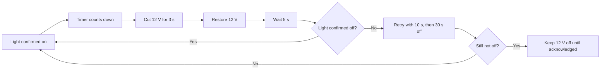

# MR MATZO / MIRROR CONTROLLER

### Turn on the mirror. Let the timer take care of the rest.

Automatic timer · Current sensing · Local web app · 3D-printed enclosure

[Hardware](docs/hardware.md) · [Measurements](docs/measurements.md) · [Enclosure](hardware/enclosure/) · [Gallery](docs/gallery.md)

**12 V mirror supply** &nbsp; / &nbsp; **INA219** &nbsp; / &nbsp; **ESP-12E**

## Why this exists

My wife never turns off her makeup mirror when she's finished. So I did what any reasonable person would do: built a Wi-Fi-enabled controller with current sensing, a web app and a custom 3D-printed enclosure to turn it off for her.

One forgotten light. One perfectly reasonable engineering project. ❤️

## The project

MrMatzo Mirror Controller is an ESP8266 timer app that switches a mirror's 12 V supply through a MOSFET. An INA219 measures current to detect when the mirror light is on and start an automatic timer. When the timer expires, the controller cuts power for three seconds to reset the mirror, then restores the 12 V supply.

The local web app at [mirror.local](http://mirror.local) displays current, voltage, power and remaining time. It also lets you set the timer duration and control the supply manually.

**Firmware 1.4.1 includes automatic shutdown recovery and password-protected browser OTA, with separate web and direct Wi-Fi passwords.** It has been compiled for NodeMCU 1.0 (ESP-12E) and checked with automated control-logic and upload-handler tests. Physical verification on the mirror is still required. The web interface and status messages are in Swedish. See [installation and OTA](firmware/README.md).

## How the timer works

1. The INA219 is read approximately every 100 ms. A moving average of ten samples smooths the current reading.
2. At least 31 mA for 700 ms confirms that the light is on and starts the timer when automatic mode is enabled and rearming is allowed.
3. The timer defaults to **10 minutes** and can be set to **1–1440 minutes**. The duration is saved in LittleFS.
4. When time runs out, 12 V is disconnected for **3 seconds**. Power is restored, followed by a **5-second** detection lockout.
5. A reading of at most 26 mA for 1000 ms confirms that the light is off. If it comes back on, the controller retries with **10-second**, then **30-second** interruptions.
6. If all three attempts fail, the controller **leaves 12 V off** and displays a fault. The fault persists across restart when LittleFS is available. Use the manual power-on button to acknowledge it. An unknown state after restoration also triggers bounded recovery.

Turning off the light before the timer expires stops the countdown. Between 26 and 31 mA, an already known light state is retained.

[Firmware and operation →](firmware/README.md)

## From prototype to enclosure

<table>
<tr>
<td width="50%"></td>
<td width="50%"></td>
</tr>
<tr><td><b>The electronics</b> Controller, current sensor and voltage converter.</td><td><b>The enclosure</b> Printed case with lid, screw mounts and cable openings.</td></tr>
</table>

## Current measurements

| Parameter | Value shown in the source material |
| :--- | :--- |
| ON threshold | 31 mA |
| OFF threshold | 26 mA |
| Threshold gap | 5 mA |
| Test duration | Approximately 295 seconds |

The plot shows steady current levels and brief peaks. The firmware uses hysteresis and confirmation periods to distinguish between on and off. The original plot has Swedish labels; an English label guide is included in the [measurement notes →](docs/measurements.md)

## Explore the repository

| Content | Location |
| :--- | :--- |
| Components and outstanding wiring details | [Hardware](docs/hardware.md) |
| Test plot and interpretation | [Measurements](docs/measurements.md) |
| All project photos | [Gallery](docs/gallery.md) |
| Enclosure model | [Box_mirror_onoff.3mf](hardware/enclosure/Box_mirror_onoff.3mf) |
| Firmware 1.3 and operation | [Firmware](firmware/README.md) |
| Remaining documentation | [Next steps](docs/next-steps.md) |

## Using the files

Open the 3MF file in compatible CAD or slicing software to inspect the enclosure. The model uses millimeters and contains two model objects. Check print settings and fit before printing; see the [enclosure documentation](hardware/enclosure/README.md).

The Arduino sketch, verified build configuration and OTA instructions are in [firmware](firmware/README.md). Firmware 1.3 needs one USB installation before wireless updates are available. A fully verified physical wiring diagram remains to be documented.

## License

Released under the [MIT License](LICENSE). Copyright © 2026 Mats Schyllander.

You are welcome to use and modify your own copy. Changes to this repository are
managed by the maintainer; see [Contributing](CONTRIBUTING.md).
