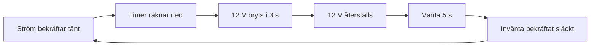

# MR MATZO / MIRROR CONTROLLER

### Spegeln tänds. Timern tar hand om resten.
Automatisk timer · Strömavkänning · Lokal webbapp · 3D-printad kapsling

[Hårdvara](docs/hardware.md) · [Mätning](docs/measurements.md) · [Kapsling](hardware/enclosure/) · [Galleri](docs/gallery.md)

**12 V matning på fotograferad adapter** &nbsp; / &nbsp; **INA219** &nbsp; / &nbsp; **ESP-12E**

## Projektet

MrMatzo Mirror Controller är en timer-app på ESP8266 som styr spegelns 12 V-matning via MOSFET. En INA219 mäter strömmen och känner av när spegelbelysningen är tänd. Då startar en automatisk timer. När tiden går ut bryts matningen i tre sekunder för att återställa spegeln, varefter 12 V kopplas tillbaka.

Via den lokala webbappen på [mirror.local](http://mirror.local) kan du följa ström, spänning, effekt och återstående tid, välja timerlängd och styra matningen manuellt.

**Firmware 1.3 finns i repot**, oförändrad från originalet. Funktionsbeskrivningen är kontrollerad mot koden; kompilering och körning på hårdvaran har inte utförts här.

## Så fungerar timern

1. INA219 läses ungefär var 100 ms. Ett glidande medelvärde över tio mätningar jämnar ut strömmen.
2. Minst 31 mA under 700 ms bekräftar att belysningen är tänd och startar timern när automatik är aktiv.
3. Timern är förvald till **10 minuter** och kan ställas på **1–1440 minuter**. Inställningen sparas i LittleFS.
4. När tiden går ut bryts 12 V i **3 sekunder**. Matningen återställs och tillståndsdetekteringen väntar **5 sekunder**.
5. Efter ett automatiskt strömavbrott måste högst 26 mA under 1000 ms bekräfta släckt läge innan en ny timer tillåts.

Om spegeln släcks innan tiden gått ut stoppas timern. Mellan 26 och 31 mA behålls ett redan känt tillstånd.

[Firmware och användning →](firmware/README.md)

## Från prototyp till kapsling

<table>
<tr>
<td width="50%"></td>
<td width="50%"></td>
</tr>
<tr><td><b>Elektroniken</b> Styrkort, mätmodul och spänningsomvandlare.</td><td><b>Kapslingen</b> Printad låda med lock, skruvfästen och kabelurtag.</td></tr>
</table>

## Mätningen

| Parameter | Visat i underlaget |
| :--- | :--- |
| ON-tröskel | 31 mA |
| OFF-tröskel | 26 mA |
| Skillnad mellan trösklar | 5 mA |
| Testlängd | Cirka 295 sekunder |

Grafen visar både stabila strömnivåer och korta toppar. Firmware använder hysteres och tidsbekräftelse för att skilja tänt från släckt läge. [Läs mätanteckningarna →](docs/measurements.md)

## Utforska projektet

| Innehåll | Här finns det |
| :--- | :--- |
| Komponenter och kvarvarande kopplingsuppgifter | [Hårdvara](docs/hardware.md) |
| Testgraf och tolkning | [Mätningar](docs/measurements.md) |
| Alla projektbilder | [Bildgalleri](docs/gallery.md) |
| Modell för kapslingen | [Box_mirror_onoff.3mf](hardware/enclosure/Box_mirror_onoff.3mf) |
| Firmware 1.3 och användning | [Firmware](firmware/README.md) |
| Återstående dokumentation | [Nästa steg](docs/next-steps.md) |

## Använd underlaget

Öppna 3MF-filen i ett kompatibelt CAD- eller slicerprogram för att granska kapslingen. Modellen anger millimeter som enhet och innehåller två modellobjekt. Utskriftsinställningar och passform behöver kontrolleras före utskrift; se [kapslingens dokumentation](hardware/enclosure/README.md).

Arduino-sketch och beroendeöversikt finns under [firmware](firmware/README.md). Exakt kortprofil, biblioteksversioner och ett fullständigt verifierat kopplingsschema återstår att dokumentera.

## Licens

Licens är ännu inte vald. Repot innehåller därför ingen öppen källkodslicens.
