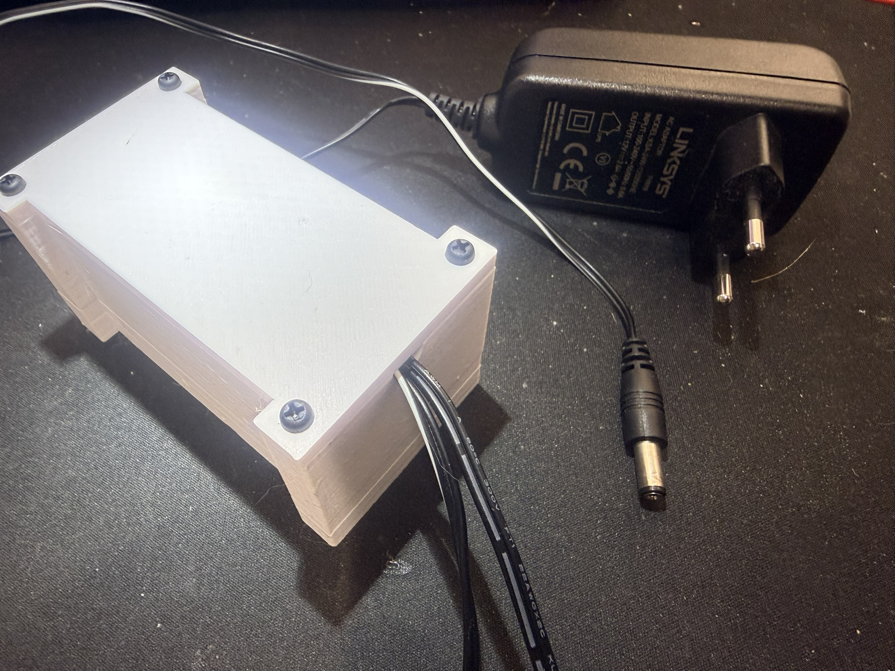
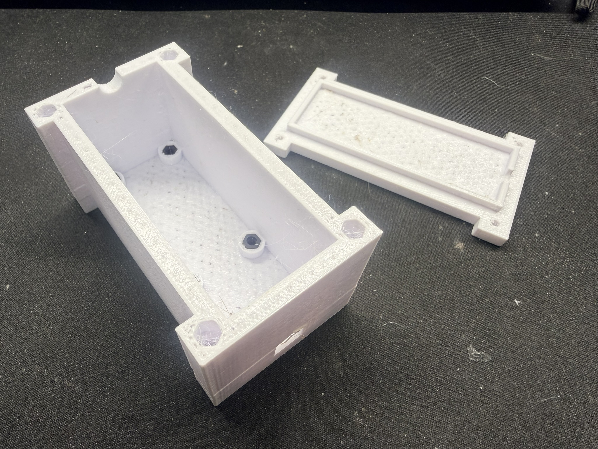
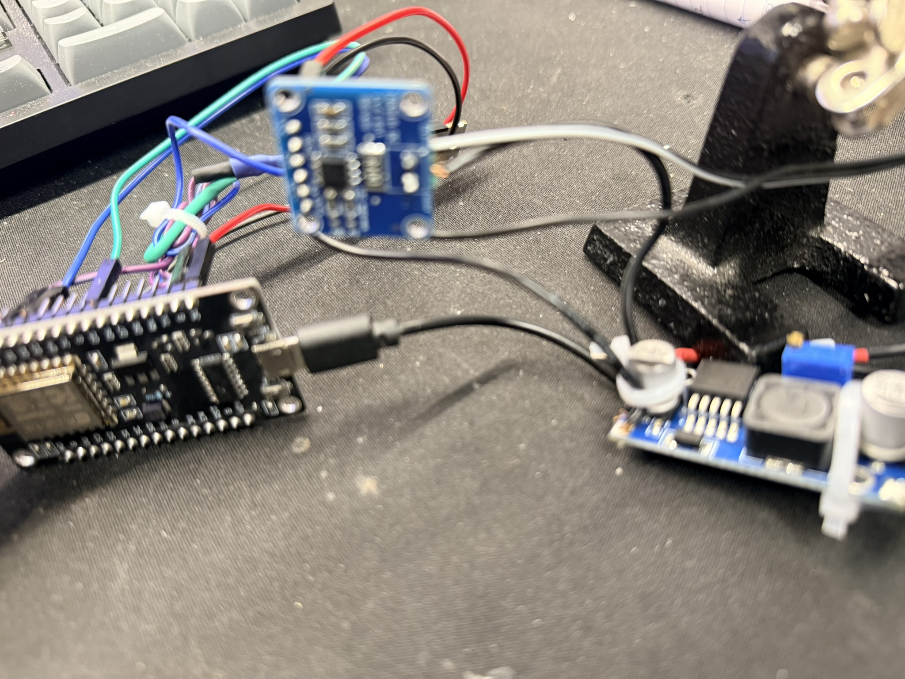
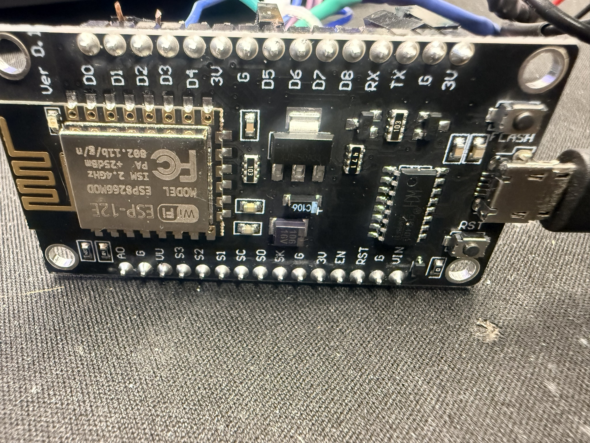
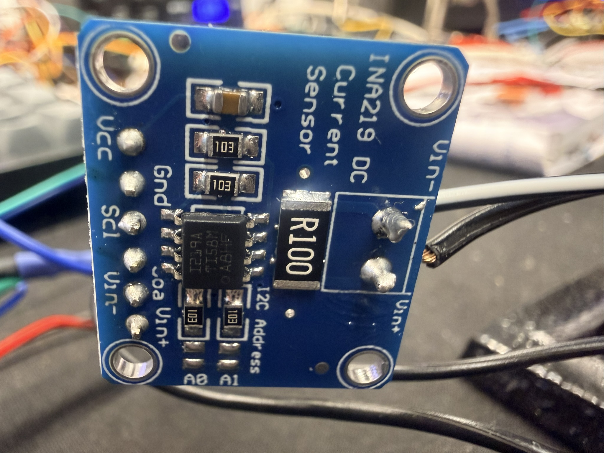
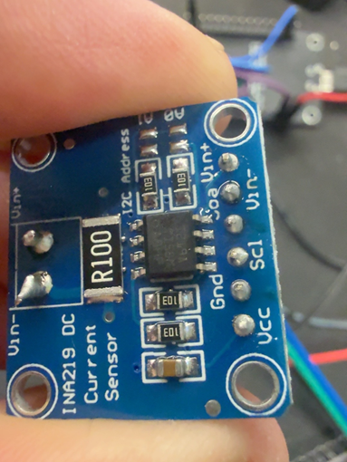
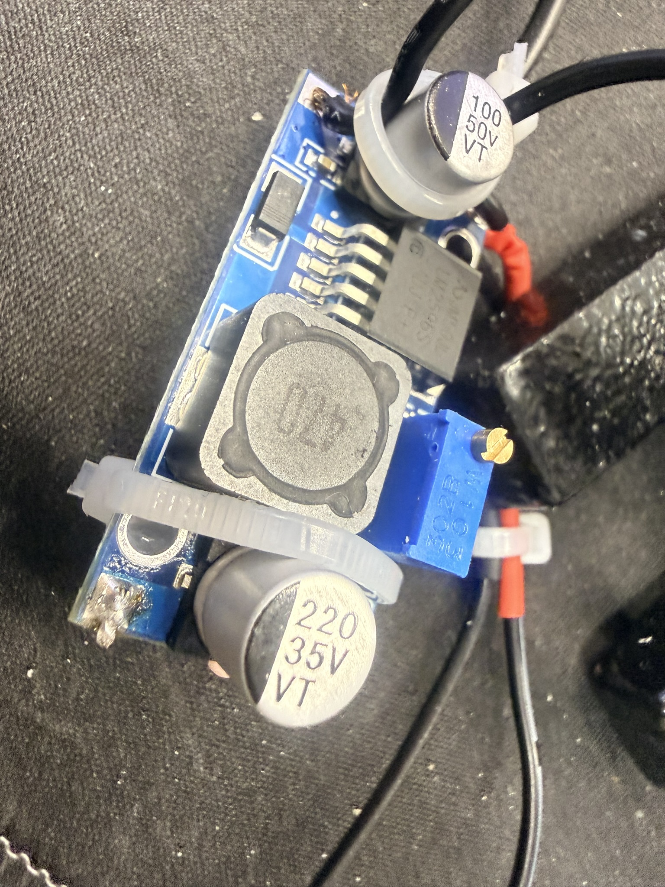
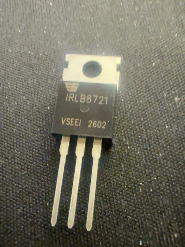
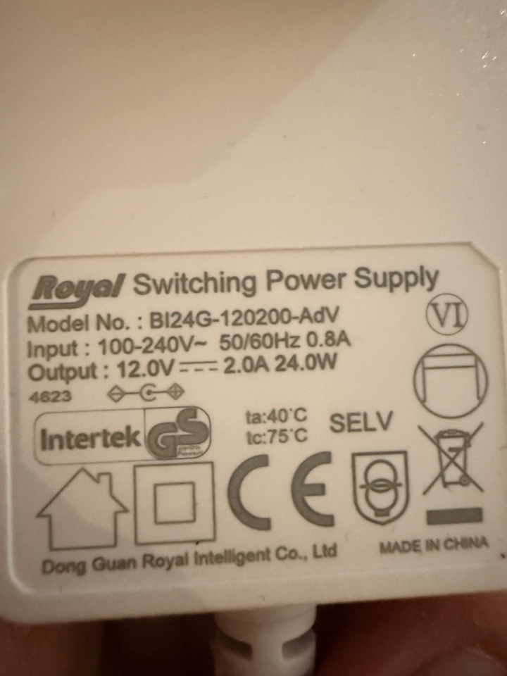
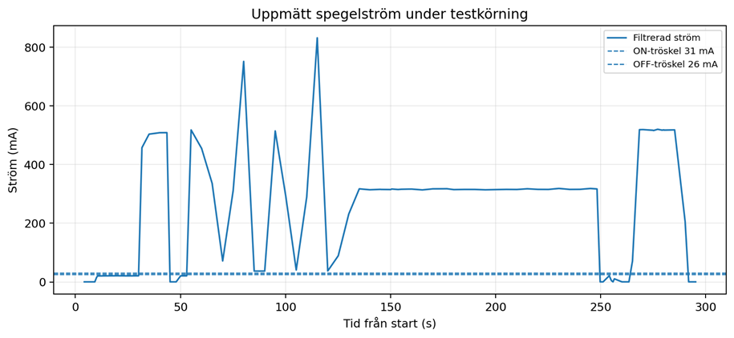

# Bildgalleri

Projektets originalbilder, kopierade utan bildbearbetning.

## Monterad kapsling

Lådan med fastskruvat lock. En svart Linksys-adapter ligger bredvid.

## Låda och lock

Kapslingens insida, fästen och kabelurtag.

## Prototyp

Elektroniken under arbetet på bänken.

## Styrkort

ESP8266-kort med ESP-12E-modul.

## Strömsensor

INA219-modulen i närbild.

## Strömsensor, ytterligare vy

Modulens märkningar och anslutningar.

## DC/DC-modul

Justerbar spänningsomvandlare.

## IRLB8721

Separat komponent fotograferad före dokumenterad montering.

## Vit nätadapter

Märkplåt: 12,0 V DC, 2,0 A och 24,0 W.

## Testkörning

Filtrerad ström med markerade trösklar.

[Tillbaka till projektet](../README.md)
