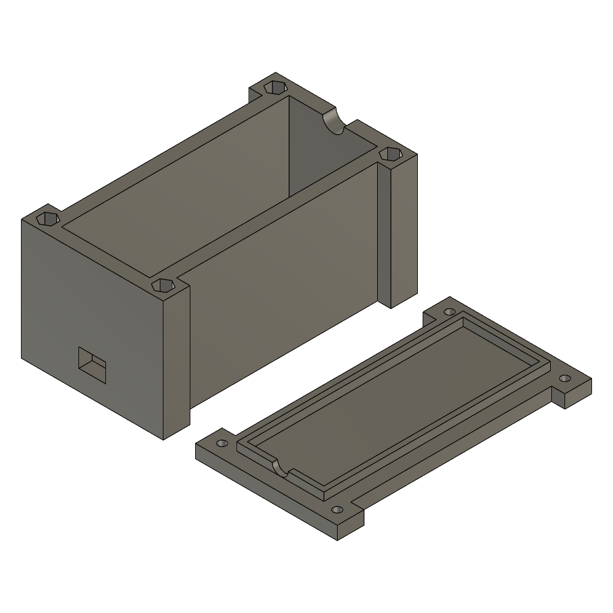

# Kapsling

[Ladda ned 3MF-modellen](Box_mirror_onoff.3mf)

Originalfilen är kopierad utan ändringar. 3MF-arkivet går att läsa och innehåller en modell med två objekt, millimeter som enhet och en inbäddad förhandsbild. Geometrins utskrivbarhet och passform har inte verifierats.

## Förhandsbild från filen

## Utskriftsuppgifter att komplettera

| Uppgift | Status |
| :--- | :--- |
| Material | Ej angivet |
| Munstycke och lagerhöjd | Ej angivet |
| Väggar och fyllnadsgrad | Ej angivet |
| Orientering och stöd | Ej angivet |
| Skruvar och muttrar | Dimensioner ej angivna |
| Passform mot elektroniken | Ej verifierad i detta repo |

[Tillbaka till projektet](../../README.md)
